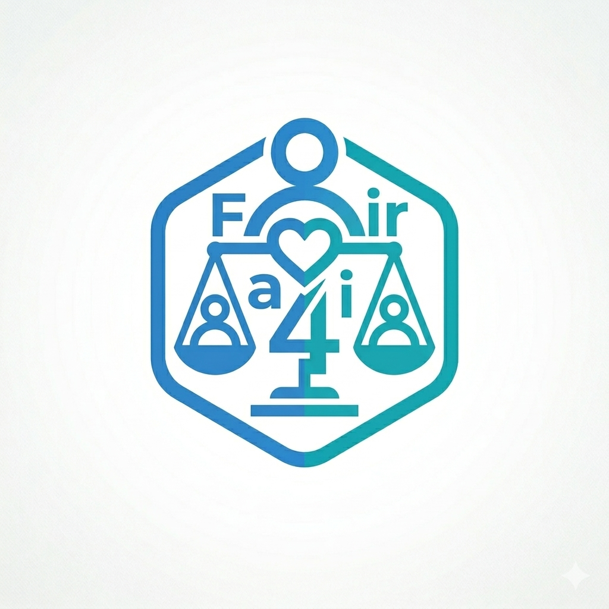

# Social Logic
We are a team founded in March 2026, based in Hong Kong, and we strive to apply Algorithmic Game Theory to build tools that ensure equitable resource distribution.

## Team Member
Joshua CHOI Kui Wang, Founder & Lead Developer
> [My Website](https://joshuasyss.github.io/)

## Projects Created
[Fair4All](https://fair4all.netlify.app/) 

> How to allocate goods fairly and efficiently to people in need is a huge and important problem.
> In Fair4All, we create a website with a simple interface to calculate how goods should be allocated.
> By using the Market Equilibrium Algorithm, we can ensure both fairness and efficiency in polynomial time.

[FairInScheduling](https://fairinscheduling.netlify.app/) 

> A lightweight web tool that converts complex real-world logistics (people, goods, dates) into clean mathematical matrices for algorithm processing.
> Uses temporal fairness to replace chaotic "first-come, first-served" models with logic that ensures equitable distribution across multiple shipment days.
> Runs entirely in the browser, making it free and incredibly easy for local nonprofits to deploy without needing backend servers or IT budgets.

## Goals
April
> Create 3 impactful projects on resource distributions for those in need
